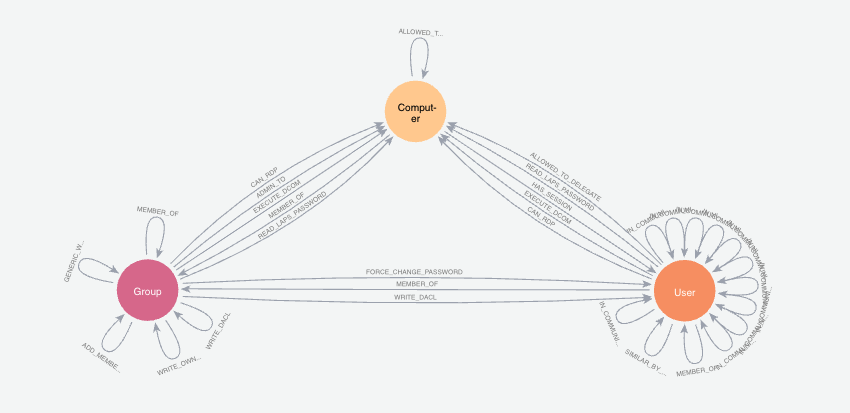

= Graphs for Cybersecurity

Accompanying event: https://www.wearedevelopers.com/event/security-day-may-2024

This repository contains code and examples for putting and exploring cybersecurity data in a graph database.

== Data set

Data is public. More information on loading and recreating the data set is coming soon. An example of the data model is shown below.

=== Loading the data

There are two options in this repository for loading the data.

1. Load the .dump file
2. Import the CSV files for nodes and relationships

To load the .dump file into a Neo4j Aura instance, you'll need to https://dev.neo4j.com/aura-java[spin up an Aura instance^]. Then click on the instance, go to the `Import` tab, drag+drop the .dump file onto the pane, and wait for the data load to complete. Note: It might take a few extra minutes after the process completes to show the data.

To import the CSV files, you will need to run the Cypher statements in the `import-csv.cypher` file to load the data. 

_More info coming soon!_
*Awaiting a fix to the APOC procedure that exports constraints, indexes, and other schema setup.*

=== Accessing with Bloom visualization tool

If you are using Neo4j Aura and loading data from the .dump file, the Bloom perspective (includes data model, saved Cypher, styling, and anything custom) should be included. You may need to choose the upper left tab, click on perspectives, and the related perspective should be listed as `WindowsDomains`.

If you are not using Aura and the .dump file, you may need to load the Bloom perspective by dragging/dropping the `Bloom_WindowsDomains.json` file from this repository into the appropriate location for the tool to pick it up.

== Notes

This data set includes additional entities and relationships that are not explored in the sample queries or accompanying presentation demo. Feel free to explore at your leisure!

== Running and testing this project

You will need the following:

1. Neo4j database instance (Aura, Desktop, Docker, etc)
2. Data set and Bloom perspective loaded
3. Explore via tools - Workspace Query for Cypher statements, Workspace Explore for natural language search. Sample queries and Bloom search phrases (using included Bloom perspective) are available in the `sample-queries.adoc` file.

== Presentation

PDF versions of accompanying presentations are published to SpeakerDeck.

* https://speakerdeck.com/jmhreif/cyber-sleuth-finding-hidden-connections-in-cyber-data[WeAreDevelopers LIVE - Security Day (May 2024)^]

== Resources

* https://sandbox.neo4j.com/[Neo4j Sandbox^]: hands-on - using similar cybersecurity data set
* https://graphacademy.neo4j.com/[Neo4j GraphAcademy^]: free, online courses
* https://dev.neo4j.com/nodes24[NODES 2024^]: free, virtual event on technical graph content